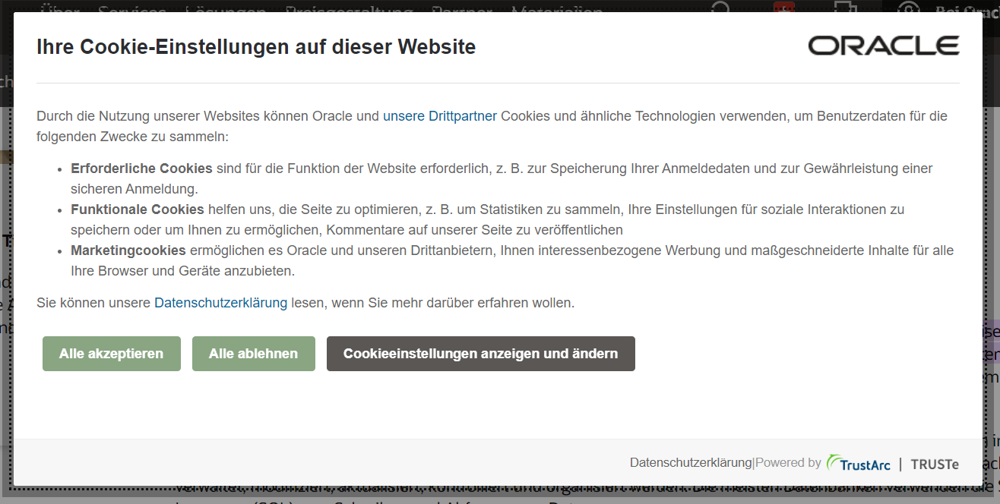
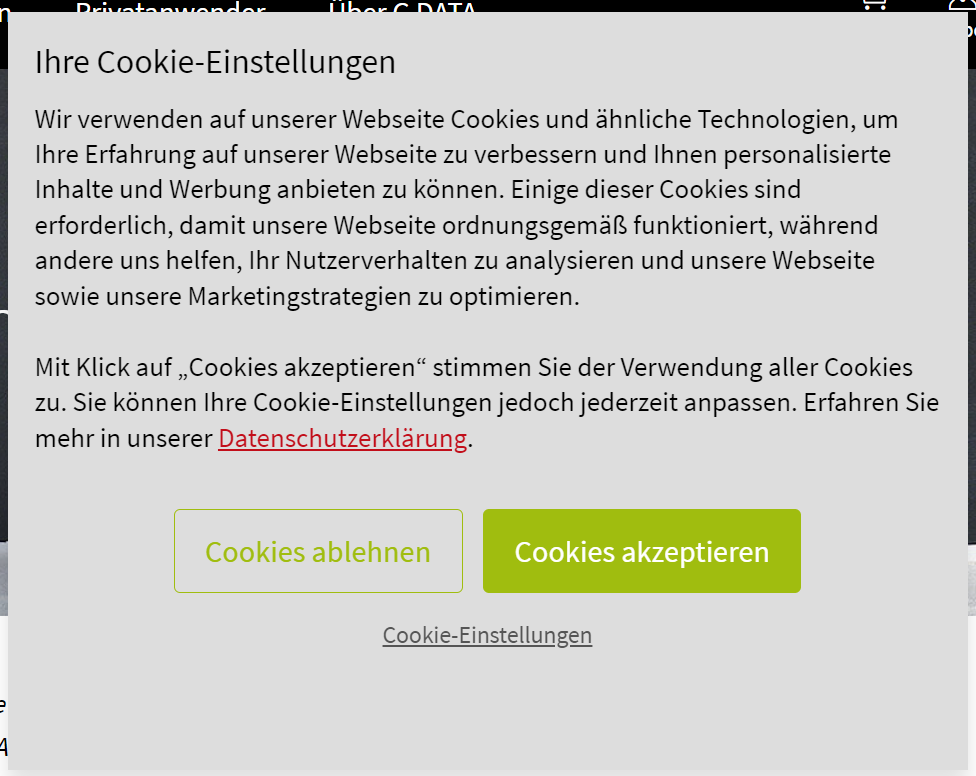
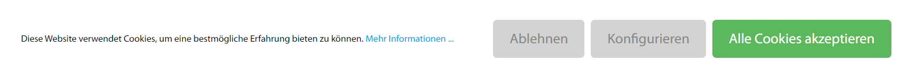

# Dokumentation Cookies

1. Je nach Webseite, welche Sie aufrufen, erhalten Sie unterschiedliche Optionen zur Auswahl  Welche Möglichkeiten finden Sie? Zeigen Sie verschiedene Beispiele!

    - Es gibt ganz unterschiedliche Möglichkeiten, welche auf den Websiten gebraucht werden. So sieht man folgende Beispiele im Netz:

2. Warum werden seit einiger Zeit solche Banner angezeigt? Seit wann?Ist das nur auf Schweizer Websites der Fall?

    - Seit 2011 sieht man solche Cookie-Meldungen, da seit dann die EU eine Cookie-Richtlinie bestimmt hat, welche genau dieses anzeigen bedingt. Es ist daher auch nicht nur auf Schweizer Webseiten, sondern auch im Ausland auf Websiten zu sehen.

3. Was sind Cookies? Welche Arten von Cookies werden unterschieden? Wo kann man diese im Browser anschauen? Braucht es Cookies? Welche Ziele haben die Besitzer der Webseiten? Was möchten Sie erreichen? Warum?

    - Cookies sind kleine Textdateien, die Websites auf deinem Gerät speichern, um Informationen über deine Online-Aktivitäten zu behalten. Sie gibt es in verschiedenen Arten: Session-Cookies verschwinden nach dem Browsen, persistente Cookies bleiben länger. Im Browser findest du die Cookie-Einstellungen meist unter Datenschutz oder Sicherheit. Dort kannst du sie einsehen, blockieren oder löschen. Cookies sind wichtig fürs Internet, machen das Einloggen leichter und personalisieren Inhalte, sind aber nicht zwingend. Du kannst sie in den meisten Browsern deaktivieren. Webseiten nutzen Cookies, um die Benutzererfahrung zu verbessern, Daten für Analysen zu sammeln und gezielte Werbung zu schalten. Sie wollen die Website effizienter und nutzerfreundlicher gestalten und gleichzeitig ihr Geschäft fördern. Cookies sind ein Werkzeug für Website-Betreiber und Nutzer mit Vor- und Nachteilen im Datenschutz. Ihr Umgang sollte transparent und kontrollierbar sein.

4. Was haben diese Banner mit Datenschutz zu tun? Worum geht es beim Datenschutz? Was sind “persönliche Daten”? Welche Reaktion auf die Banner würden Sie BenutzerInnen empfehlen? Sollen bspw. immer alle akzeptiert werden?

    - Die Banner behiehen sich auf unser Recht, dass wir wissen dürfen, welche Daten von uns bearbeitet werden. Beim Datenschutz geht es darum die Personendaten zu schützen und somit unsere Privatsphäre zu bewahren. Persönliche Daten können zum Beispiele der Name, Wohnort oder auch der Aufenthaltsort sein. Ich würde Benutzer empfehlen, dass Sie die Banner prinzipiell ablehnen sollen. 

5. Was passiert, wenn jemand eine Option akzeptiert hat?  Kann die Person Ihre Meinung danach wieder ändern? Wenn ja: Wie?

    - Wenn eine Option akzeptiert wird, können die jeweiligen Daten, welche vom User zu diesem Punkt generiert werden im Cookie gespeichert werden. Die Person kann die Daten wieder lokal löschen (Broswercache), jedoch kann es sein, dass sich der Webserver einige Daten davon bezieht, auf welche die Person keinen Zugriff hat.

6. Welche gesetzlichen Vorgaben in Sachen Datenschutz gibt es für die Firmen? Was heisst das für Sie, als Person, die in der Informatik arbeitet?

    - Firmen haben sich an das Datenschutzgesetz zu halten, welches sehr auführlich ist und alle relevanten Punkte bedeckt. Für mich persönlich ist wahrscheinlich die Sorgfaltspflicht von besonderer Bedeutung, da ich immer sorgfältig beim Bearbeiten von Personendaten vorgehen sollte.

7. Einige Firmen werden mit dem Wort “Datenkraken” assoziiert. Nennen Sie Beispiele und Hintergründe!

    - Einige Unternehmen gelten als "Datenkraken", weil sie große Mengen persönlicher Daten sammeln und nutzen. Facebook ist bekannt für die Erfassung von Nutzerinformationen zur gezielten Werbung. Google speichert Suchanfragen, Standorte und mehr für personalisierte Dienste. Amazon verfolgt das Kaufverhalten für Empfehlungen. Diese Firmen geraten oft in Kritik wegen Datenschutzbedenken und des Potenzials für Datenmissbrauch oder -handel. Sie betonen jedoch auch, dass sie Datenschutzrichtlinien haben und die Daten zur Verbesserung ihrer Dienste verwenden.

### Persönliche Reflexion

Während des Auftrags habe ich das Grundprinzip von Cookies verstanden und mein Wissen auch gleich anwenden können. So habe ich verschiedene Techniken im Umgang mit Cookies kennengelernt, dabei stand das Thema Datenschutz immer im Zentrum. Allgemein bleibt das bekannte Grundprinzip weiterhin bestehen, es geht darum möglichst vorsichtig mit persönlichen Daten umzugehen und diese nicht einfach so herauszugeben. Bei Cookies muss man besonders vorsichtig sein, da sie für viele Enduser kein richtiger Begriff sind und somit grosse Mengen an Personendaten sammeln.